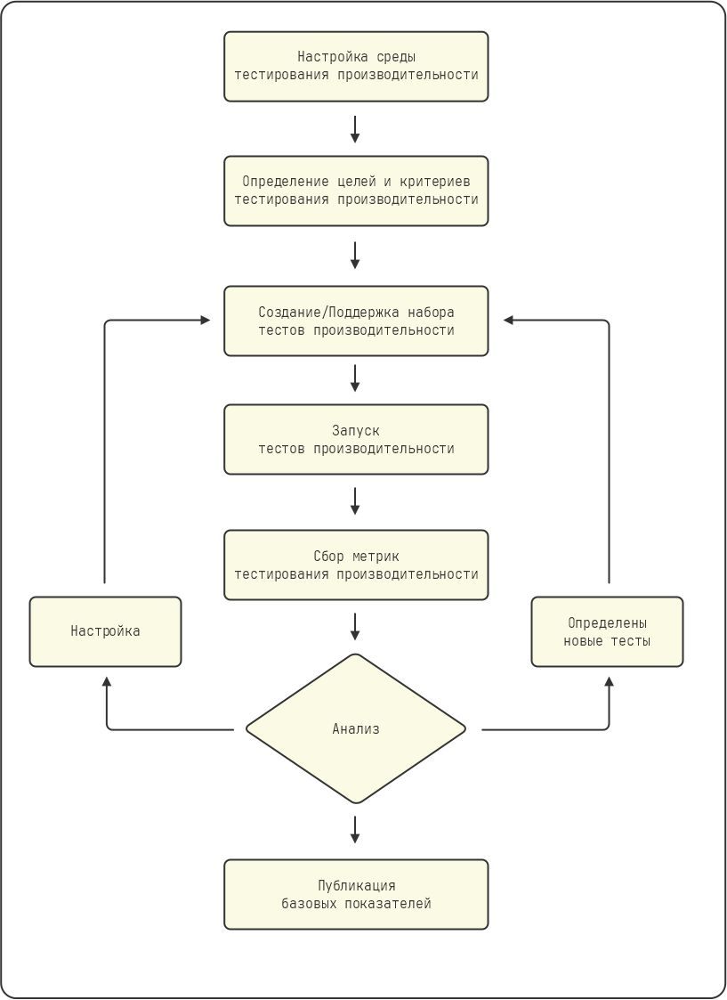

# Теория

## Зачем тестировать производительность

Улучшение производительности влияет на итоговый результат (прибыльность) бизнеса, поскольку
оно обеспечивает лучший пользовательский опыт, укрепляет бренд и удерживает клиентов. Улучшенная производительность использует меньше ресурсов и использует их с большей эффективностью.

## Почему JMeter

JMeter - это промышленный инструмент для тестирования производительности. Он является высококлассный проект с открытым исходным кодом Apache.  
Но бесплатность - не единственная причина его популярности. Это очень мощный инструмент. С момента своего создания в 2001 году он постоянно совершенствуется. Коммерческие инструменты могут иметь более дружественные пользовательские интерфейсы или красивые отчеты, но и JMeter может быть сконфигурирован для обеспечения тех же требований.  
JMeter можно запустить в "распределенном режиме" в облаке, создавая нагрузку в виде тысяч пользователей. JMeter поставляется с лицензией Apache, которая не имеет никаких
ограничений на использование, распространение или модификацию.
JMeter имеет стандартный формат для написания тестов производительности. Большинство коммерческих инструментов поддерживают импорт/экспорт в JMX (формат тестовых файлов JMeter).

## Цели и задачи нагрузочного тестирования

Тестирование производительности - это тестирование системы или приложения с целью измерения некоторых его атрибутов таких как время отклика, пропускная способность, масштабируемость и т.д. Эти атрибуты называются критериями производительности.  
Существует множество типов тестов производительности, каждый из которых измеряет различные критерии производительности. В зависимости от характера приложения, некоторые из критериев производительности могут быть более важными, чем другие.  
Тестирование производительности отличается от функционального тестирования. При тестировании производительности мы в первую очередь фокусируемся на скорости, в то время как функциональное тестирование связано с корректностью поведения приложения.
Хотя тесты производительности являются частью непрерывного цикла сборки наряду с функциональными тестами, результаты тестирования производительности следует интерпретировать только после того, как приложение пройдет функциональные тесты.

## Критерии производительности

### Время отклика

Время, которое требуется приложению для ответа на запрос клиента, называется _временем отклика_. Оно измеряется
в секундах или миллисекундах, в зависимости от конкретного приложения. Каждое приложение должно стремиться к минимизации
время отклика.

Вот несколько определений, связанных со временем отклика:

- Абсолютное время отклика: это общее время, которое проходит с момента отправки данных до полного получения ответа сервера.
- Время обработки сервера: это время, необходимое серверу для обработки входных данных и генерации выходных данных. Это время может варьироваться в зависимости от сложности запроса, аппаратного обеспечения сервера и нагрузки на систему.
- Сетевая задержка: это время, затрачиваемое пакетом данных на прохождение по сети к серверу и обратно. Сюда не входит время обработки данных на сервере.

### Пропускная способность

Последовательность запросов/ответов представляет собой транзакцию. Количество транзакций в единицу времени называется пропускной способностью. Она измеряется в транзакциях/секунду или в пропускной способности _сети_ (байты/секунду). Она зависит от аппаратного обеспечения сервера, нагрузки на систему и сетевой задержки. Приложение должно стремиться к максимизации пропускной способности.

### Утилизация или использование

Утилизация - это отношение пропускной способности приложения к его максимальной мощности.  
Этот показатель отражает насколько эффективно используется приложение. Нежелательно работать с утилизацией на уровне выше 80 %, поскольку пользовательские запросы поступают неравномерно, и система должна быть в состоянии справиться с резким увеличением нагрузки.

### Надежность

Это показатель того, насколько хорошо приложение обнаруживает и обрабатывает различные ошибки и исключения.  
Если система падает или становится недоступной, на карту ставится бренд и репутация компании. Среднее время между отказами (MTbF) - это метрика, которая часто используется для этой цели.

### Масштабируемость

Масштабируемость измеряет, насколько хорошо система может наращивать свою мощность при добавлении дополнительных ресурсов.  
В идеале пропускная способность системы будет увеличиваться линейно по мере добавления дополнительных ресурсов, однако на практике это редко достигается. Хорошим показателем является знание ресурсов, которые потребуются для того, чтобы система могла справиться с прогнозируемой будущей нагрузкой.

### Стоимость

Система должна потреблять меньше ресурсов и экономить деньги компании. Утилизация и пропускная способность - это некоторые из показателей, влияющих на стоимость.

## Типы тестов производительности

Термин "тест производительности" широко используется для обозначения множества различных типов тестов.

### Стресс-тесты

Стресс-тест - это вид теста производительности, который проверяет работу приложения далеко за пределами нормальной и ожидаемой пиковой нагрузки. После теста отмечается стабильность и производительность приложения. Этот тип тестов используется для определения того, как приложение реагирует на скачки нагрузки.

### Нагрузочные тесты

Нагрузочный тест - это вид теста производительности, который выполняется при заданном уровне нагрузки. Работу приложения оценивают и измеряют при нормальной ожидаемой нагрузке.

### Тесты пиковой нагрузки

Пиковый нагрузочный тест проводится при нагрузке, которую должно выдержать приложение. Например, сайты электронной коммерции испытывают пик нагрузки во время "черной пятницы", "киберпонедельника" и рождественских праздников. Поэтому тест пиковой нагрузки в этом случае проверяет приложение в рамках спецификации нагрузки, но на более высоком уровне.

### Испытание на выносливость

При испытании на выносливость приложение в течение длительного времени подвергается нормальной ожидаемой нагрузке. Тестирование проводится в течение многих часов. Этот тест определяет, правильно ли приложение использует свои ресурсы и позволяет выявить следующие проблемы:

- Утечки памяти в приложении
- Исчерпание соединений с базой данных
- Исчерпание сетевых соединений
- Переполнение файлов журнала и ротация журнала
- Исчерпание других ресурсов

### Тесты на масштабируемость

Масштабируемость определяется тем, насколько хорошо приложение справляется с увеличением нагрузки при сохранении желаемых критериев производительности.  
Тест на масштабируемость позволяет увеличить ресурсы и проверить, обеспечивает ли приложение
соответствующее увеличение производительности. В идеале мы ожидаем линейной масштабируемости (т. е. удвоение аппаратных ресурсов должно привести к удвоению производительности приложения).

### Тесты производительности

Тест производительности - это нагрузочный тест, который устанавливает максимальную нагрузку, которую может выдержать приложение при соблюдении желаемых критериев производительности. Полученная метрика называется максимальной производительностью. Она используется при
масштабировании приложения и для оценки затрат на будущий рост.

### Испытания на всплеск и пиковую мощность

Испытание на всплеск - это нагрузочное испытание, при котором приложение подвергается кратковременному внезапному увеличению нагрузки, на небольшую долю превышающей максимальную мощность. Обычно это делается для оценки хрупкости/прочности приложения. Ожидается, что приложение будет устойчивым и продолжит соответствовать критериям производительности во время всплеска. Эта метрика называется пиковой мощностью.

### Смоук тесты производительности

При смоук тестировании производительности несколько общих и важных сценариев использования, а также сценарии использования, относящиеся к коду, подлежащему изменению, вместе проверяются на производительность. Только когда смоук тест проходит успешно, проводится полный набор тестов производительности. Если дымовой тест провален, дальнейшие тесты производительности не проводятся до тех пор, пока дефект производительности не будет устранен.

### Тесты высокой доступности/отказоустойчивости

Для обеспечения высокой доступности и устойчивости к аппаратным и программным сбоям. В идеале архитектура должна обеспечивать отсутствие единой точки отказа и наличие резервных серверов, которые могут прозрачно взять на себя управление, не влияя на работу пользователей. В ходе этого теста моделируются различные сбои оборудования и программного обеспечения и проводятся соответствующие тесты производительности.
чтобы убедиться, что приложение по-прежнему соответствует критериям производительности.

## Среда тестирования производительности

Оборудование и программное обеспечение, используемое для проведения тестирования производительности, называется средой тестирования производительности.  
Обычно она отделена от производственной среды. Хотя это и не рекомендуется, иногда тестирование проводится в самой производственной среде.

### Необходимость отдельной среды для тестирования производительности

Тестирование производительности не должно проводиться в производственной среде, так как это может негативно сказаться на пользовательском опыте.
Нагрузка от тестирования производительности может:

- Разрушить систему
- Ухудшить время отклика приложения
- Создать бреши в безопасности из-за использования тестовых учетных записей
- Засорить производственные базы данных входными и выходными данными тестов производительности
- Заполнить базы данных, файлы журналов приложений и системные журналы
- Влиять на аналитику

В долгосрочной перспективе целесообразно иметь выделенную среду производительности, поскольку это позволит избежать этих подводных камней и обеспечит преимущества непрерывной интеграции (CI).
Тестирование производительности должно проводиться до того, как программное обеспечение будет запущено в производство. В идеале оно должно быть частью процесса сборки, чтобы можно было быстро обнаружить и устранить любые дефекты производительности, возникшие в результате изменений в программном обеспечении.

### Cреда тестирования производительности

Среда тестирования производительности должна быть смоделирована по образцу производственной среды. В идеальном сценарии среда тестирования производительности должна быть копией производственной среды с точки зрения аппаратного и программного обеспечения, сети, компонентов и топологии. Однако из-за бюджета и других ограничений это может оказаться невозможным. В таких случаях среда тестирования производительности должна имитировать производственную среду во всех
ключевых аспектах. При этом придется пойти на некоторые логические компромиссы. Например, сокращение числа узлов кластера или экземпляров базы данных.

### Среда тестирования производительности должна быть изолирована

Среда тестирования производительности должна находиться в другой подсети, изолированной от производственной среды, так что любая деятельность в подсети производительности не будет влиять на производственный стенд и наоборот.

### Инструменты для тестирования производительности

Инструменты для тестирования производительности должны обеспечивать генерацию нагрузки, сбор данных о производительности, анализ и отчетность. Инструменты должны быть определены и их конкретные функции / использование изучены и задокументированы заблаговременно. Эти инструменты должны быть установлены на соответствующих серверах в среде.

## Документ о стратегии тестирования производительности

Стратегия тестирования производительности - это документ, определяющий требования к тестированию производительности и его цели, а также подход к их достижению и поддержанию. Она содержит политику и методологию тестирования производительности. Этот документ отражает мышление ответственных руководителей бизнеса и ИТ-отдела и подписывается ими.

### Требования к производительности

Как уже говорилось, существует множество критериев производительности, которые используются в отрасли. Хотя все они могут быть полезны, только часть из них применима к вашему конкретному приложению. Кроме того, еще меньшее число может иметь критическое значение из-за контрактных обязательств, соглашений об уровне обслуживания (SLA) или условий владельца приложения. Выявленные таким образом критерии называются требованиями к производительности. Иногда эти требования диктует характер бизнеса. Например, для приложения, предназначенного для торговли акциями, время отклика должно составлять доли секунды. Каждый релиз должен соответствовать этим требованиям.

### Цели тестирования производительности

Цели тестирования производительности - это критерии, которые желательны, но не критичны. Они часто определяются производительностью аналогичных приложений конкурентов. Достижение этих целей будет выгодно для бизнеса. Требования к производительности являются абсолютными, в то время как цели производительности являются желаемыми.

### Набор тестов производительности

Набор тестов производительности - это набор тестов, которые измеряют цели и требования к тестированию производительности.  
Стратегия тестирования производительности компании может потребовать несколько наборов тестов производительности, причем не все наборы тестов должны быть выполнены каждый раз. Например, набор тестов на масштабируемость будет выполняться при подготовке к напряженным периодам, таким как Новый Год, в то время как набор смоук-тестов выполняется как часть процесса сборки.  
Модели использования приложений могут быть определены либо путем анализа журналов , либо предоставлены владельцем продукта или маркетологом. Они учитываются при создании набора тестов.
Набор тестов претерпевает изменения в соответствии с меняющимися потребностями приложения. Новые тесты производительности добавляются для новых функций продукта, старые тесты производительности устаревают для устаревших функций, существующие тесты производительности улучшаются на основе анализа отчетов о производительности.

### Отчеты и анализ производительности

Отчеты о тестировании производительности анализируются для выявления случаев, когда требования к производительности не выполняются. Такие случаи регистрируются как критические дефекты.
Производительность также сравнивается с базовыми показателями, чтобы отметить тенденции. Любое отклонение доводится до сведения команды для дальнейшего анализа и принятия мер.

### Настройка производительности

Команда инженеров рассматривает и модифицирует приложение для устранения дефектов и проблем, выявленных в отчетах о производительности. Эти изменения могут включать в себя модификацию конфигурации, кода, сети, архитектуры, топологии и т.д. На рисунке ниже показан процесс тестирования/настройки производительности.

